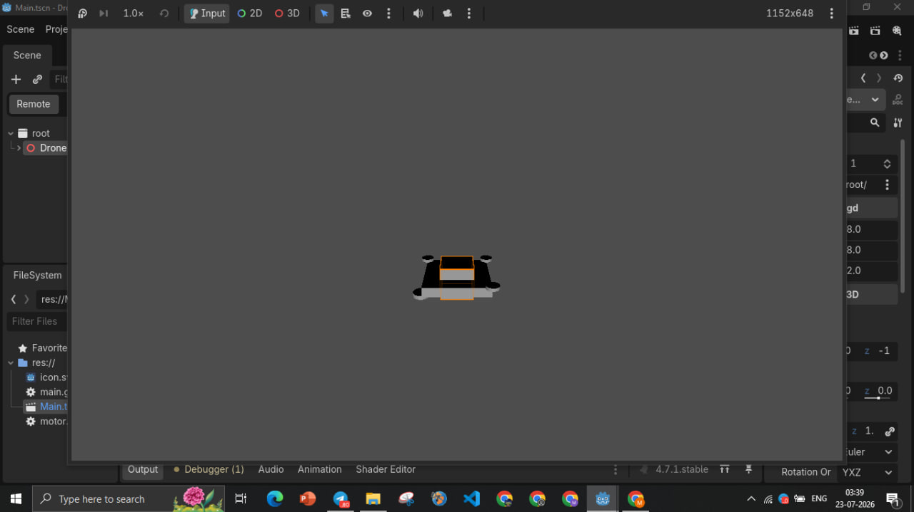
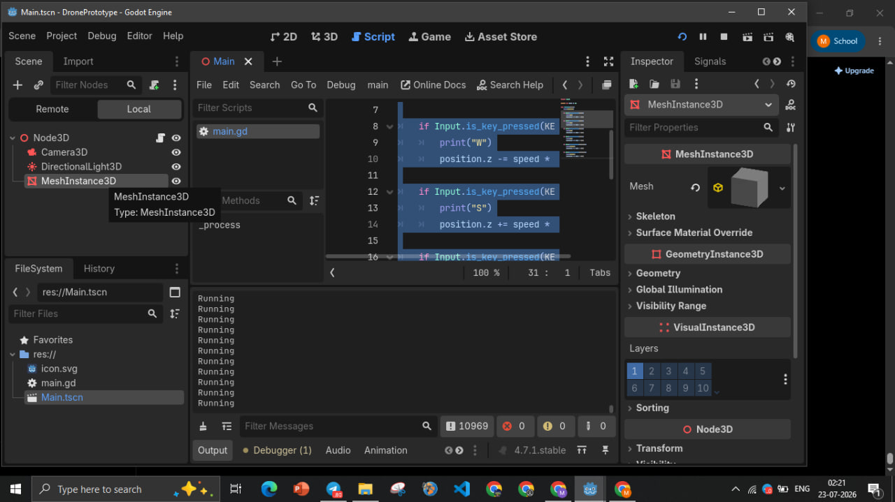

# 🚁 Drone Movement Prototype

A small 3D drone movement prototype developed using **Godot Engine** and **GDScript**. This project was created to explore basic 3D movement, controls, camera setup, and game development concepts.

## 🎮 Features

* 🚁 3D drone movement
* ⬆️ Up and down movement
* ⬅️➡️ Left and right movement
* 🌍 Basic 3D environment
* 🎥 Camera setup
* ⚙️ Motor movement
* 🎮 Basic movement controls

## 🛠️ Technologies & Tools

* **Godot Engine**
* **GDScript**
* **3D Game Development**

## 📸 Screenshots

### 🚁 Drone Prototype

Screenshots of the drone prototype and its movement.



### 🖥️ Godot Editor

Screenshots of the Godot Editor showing the development environment.



## 📚 What I Learned

* Basic Godot scene setup
* GDScript fundamentals
* 3D object movement
* Input handling and controls
* Camera setup
* Debugging and experimentation
* Basic game development workflow

## 📁 Repository Structure

```text
Drone-movement-prototype/
│
├── images/
│   ├── drone-prototype/
│   │   └── Drone screenshots
│   │
│   └── godot-editor/
│       └── Godot Editor screenshots
│
└── README.md
```

## ⚠️ Project Note

This repository contains documentation and screenshots of the drone movement prototype. The original Godot project files and source code are not currently included in this repository.

## 👩‍💻 Project

**Drone Movement Prototype**
Developed using Godot Engine and GDScript.
